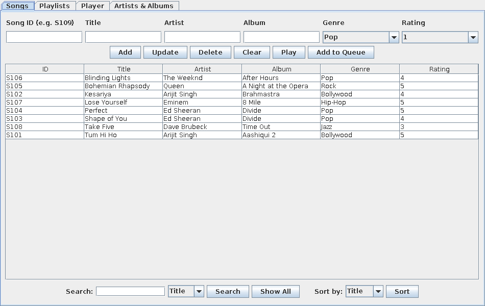
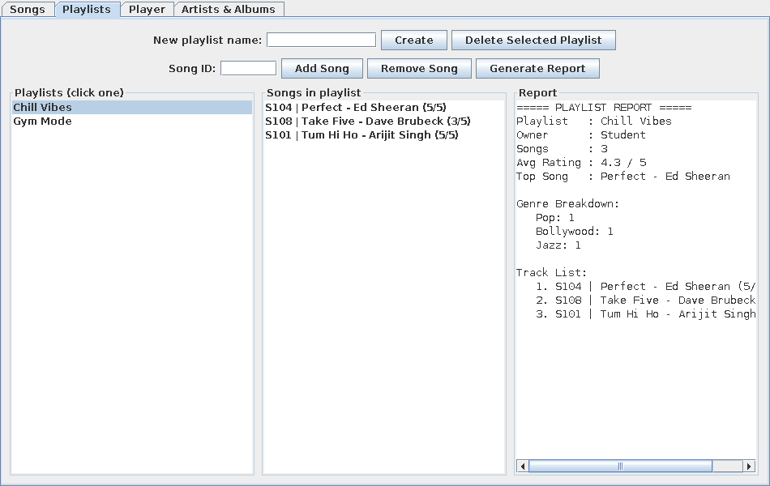
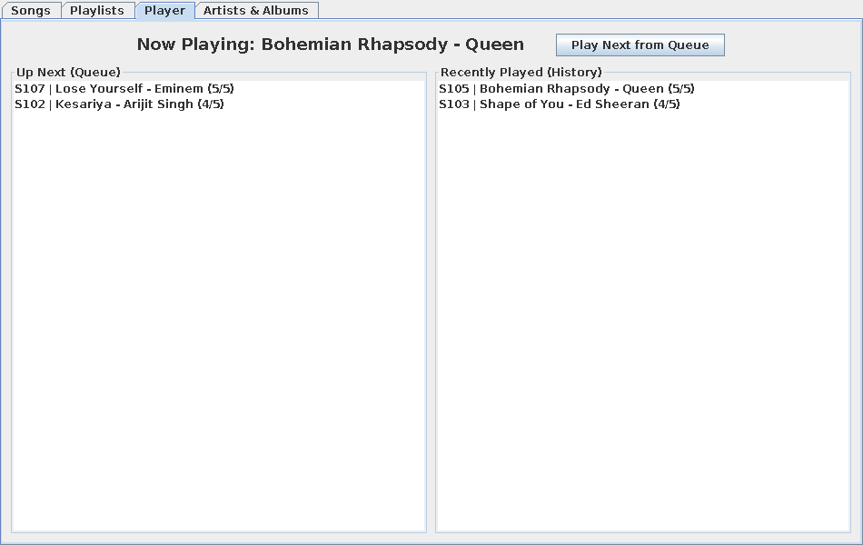
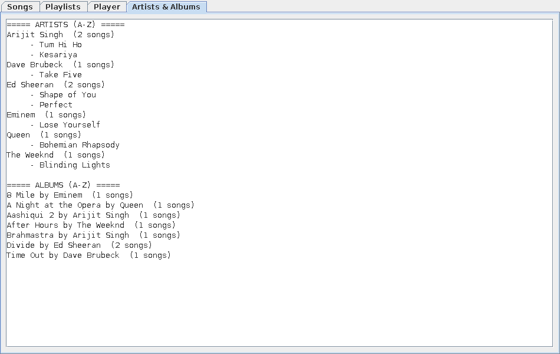
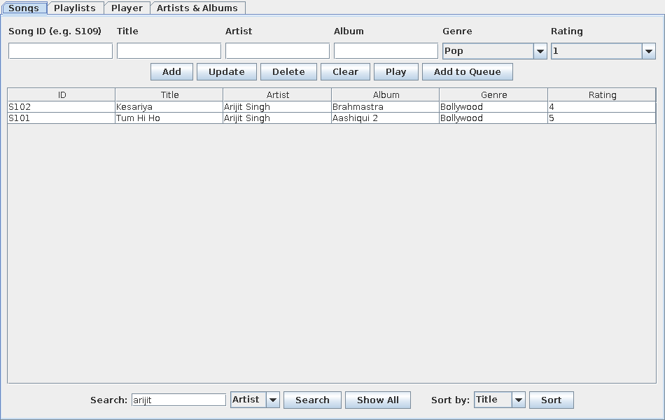
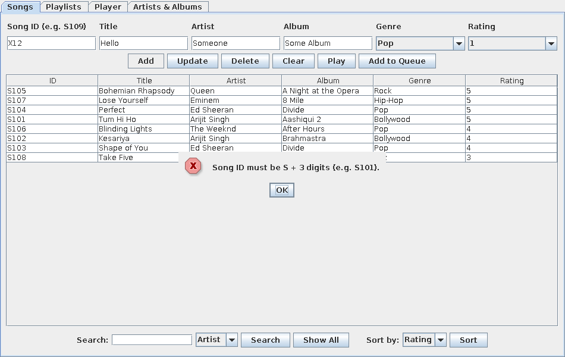
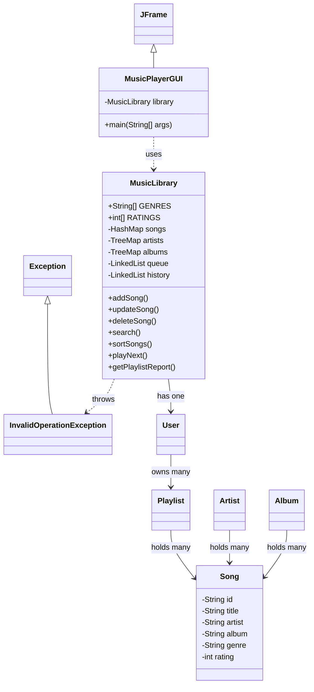

[README.md](https://github.com/user-attachments/files/32696375/README.md)
# 🎵 Music Playlist Management System


A desktop music library app built in **Java** with a **Swing GUI**. It manages songs, artists, albums, playlists and playback history. You can add, update, delete, search and sort songs, build playlists, queue songs, and generate playlist reports.

> **Course:** Java Programming, B.Tech CSE (2025–29), Semester III
> **University:** ITM Skills University, School of Future Tech

---

## 📸 Screenshots

| Songs tab | Playlist report |
|---|---|
|  |  |

| Player (queue + history) | Artists & Albums (A–Z) |
|---|---|
|  |  |

| Search by artist | Validation error popup |
|---|---|
|  |  |

---

## ✨ Features

| # | Module | What it does |
|---|---|---|
| 1 | **Song Management** | Add, view, update and delete songs (full CRUD) |
| 2 | **Artist Management** | Artists are created and removed automatically with their songs |
| 3 | **Album Management** | Albums are grouped automatically and listed A–Z |
| 4 | **Playlist Creation** | Create and delete playlists |
| 5 | **Add / Remove Song** | Add or remove songs in a playlist (duplicates blocked) |
| 6 | **Search** | Search by title, artist or album (case-insensitive) |
| 7 | **Sorting** | Sort by title, artist or rating |
| 8 | **Playback Queue** | Queue songs and play them in order (FIFO) |
| 9 | **History** | Keeps the last 10 played songs, newest first |
| 10 | **Playlist Report** | Song count, average rating, top song, genre breakdown |

---

## 🧠 Java Concepts Used

| Concept | Where it's used |
|---|---|
| Classes & Objects | `Song`, `Artist`, `Album`, `Playlist`, `User` |
| Constructors | Every model class, e.g. `new Song(id, title, artist, album, genre, rating)` |
| Array | `GENRES[]` and `RATINGS[]` fill the dropdowns; `int[] genreCount` in the report |
| ArrayList | Songs inside playlists, artists and albums; the user's playlists |
| LinkedList | Playback `queue` and `history` |
| HashMap | `songs`: Song ID → Song, for O(1) look-up |
| TreeMap | `artists` and `albums`, which are kept sorted A–Z automatically |
| CRUD | `addSong()`, `getSong()`, `updateSong()`, `deleteSong()` |
| Searching | `search()` by title, artist or album |
| Sorting | `sortSongs()` using comparators |
| Swing | `MusicPlayerGUI`: 4 tabs, tables, lists, buttons |
| Exception Handling | Custom `InvalidOperationException`, shown as error popups |
| Validation | Song ID format, title length, rating 1–5, genre, duplicate checks |

---

## 🏗️ Architecture

The app uses a simple three-layer design. The GUI only displays data, `MusicLibrary` holds all the logic, and the model classes hold the data.



---

## 📁 Project Structure

```
java_mini_project/
├── MusicPlayerGUI.java              → Swing window (program starts here)
├── MusicLibrary.java                → all data and all logic
├── InvalidOperationException.java   → custom exception
├── Song.java                        → one song
├── Artist.java                      → an artist and their songs
├── Album.java                       → an album and its songs
├── Playlist.java                    → a user playlist
└── User.java                        → the user and their playlists
```

---

## 🚀 How to Run

**Requirements:** JDK 17 or later.

**From the terminal:**
```bash
git clone https://github.com/TanishRS/java_mini_project.git
cd java_mini_project
javac -d out *.java
java -cp out MusicPlayerGUI
```

**From an IDE (IntelliJ / VS Code / Eclipse):** open the folder and run `MusicPlayerGUI.java`.

The app starts with **8 sample songs** and **2 playlists** ("Chill Vibes" and "Gym Mode"), so you can try every feature right away.

---

## ✅ Validation Rules

| Input | Rule |
|---|---|
| Song ID | `S` followed by 3 digits (e.g. `S101`), and must be unique |
| Title | 1 to 50 characters |
| Artist / Album | Cannot be empty |
| Genre | Pop, Rock, Hip-Hop, Bollywood, Classical, Jazz or EDM |
| Rating | 1 to 5 |
| Playlist name | 1 to 30 characters, and must be unique |
| Playlist / Queue | The same song cannot be added twice |

Any invalid action shows a clear error popup instead of crashing the app.

---

## ⏱️ Time Complexity

| Operation | Complexity | Why |
|---|---|---|
| Find song by ID | O(1) | HashMap |
| Add song | O(log n) | TreeMap insert for the artist and album |
| Search | O(n) | Linear search |
| Sort | O(n log n) | `ArrayList.sort()` |
| Play next | O(1) | `LinkedList.removeFirst()` |

---

## 🔮 Future Improvements

- Save data to a file or database so it is kept after closing the app
- Real audio playback using `javax.sound`
- Multiple users with login
- A modern UI with JavaFX

---

## 👥 Team

| Name | GitHub |
|---|---|
| Tanish Ramesh Suvarna | [@TanishRS](https://github.com/TanishRS) |
| Aareen Dakway | [@Aareen80085](https://github.com/Aareen80085) |
| Shobit Saroj | [@sarojshobit2007-web](https://github.com/sarojshobit2007-web) |
